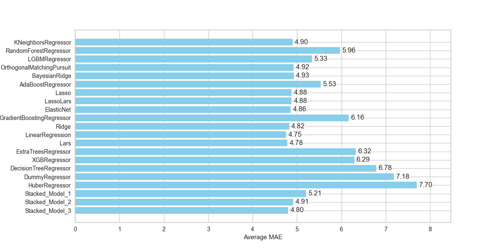
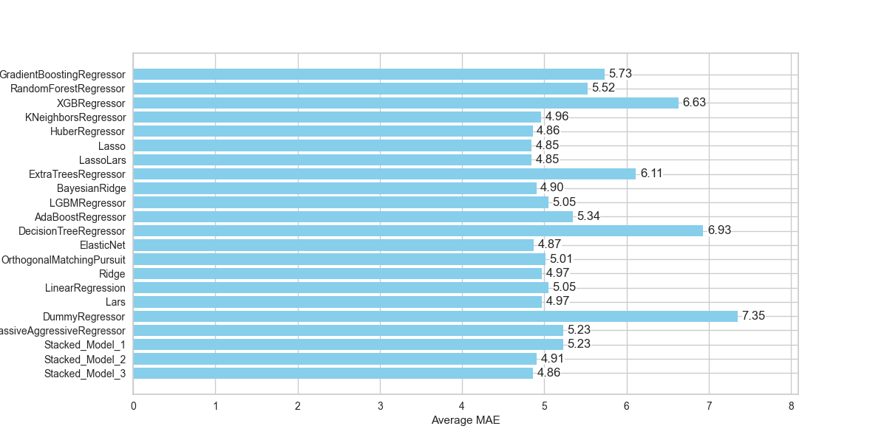

# Research_France_KanjiRintarou
## Abstract
This is a study that uses a regression model to predict the total power consumption of two processes running simultaneously on a GPU.
Using the PyCaret library, we studied which regression models could accurately predict the total power consumption, and how the accuracy changes when the total power consumption is normalized or not. 
The results showed that Lenear Regressor had the best accuracy with MAE=4.75 when not normalized.

## 1. Not_Normalized

I excuted PyCaret libraly and got this figure about MAE score.

Feature is below. And target is total power.
- layers_1 (Number of layer in model1)
- layers_2
- batch_size_1
- batch_size_2
- model1_Param
- model2_Param
- model1_FLP
- model2_FLP
  
And I understand Linear Regression is good score(MAE=4.75).

## 2. Normalized

This is the result of normalizing Power and regression forecasting. After regression forecasting, the results were denormarlized. I used MAE as the evaluation method.

Feature is below(Same with above). And target is total power.
- layers_1 (Number of layer in model1)
- layers_2
- batch_size_1
- batch_size_2
- model1_Param
- model2_Param
- model1_FLP
- model2_FLP

Lasso and LassoLars had the lowest value at 4.85. However, when the experiment was performed with the same variables without normalization, Lenear Regressor was 4.75.

